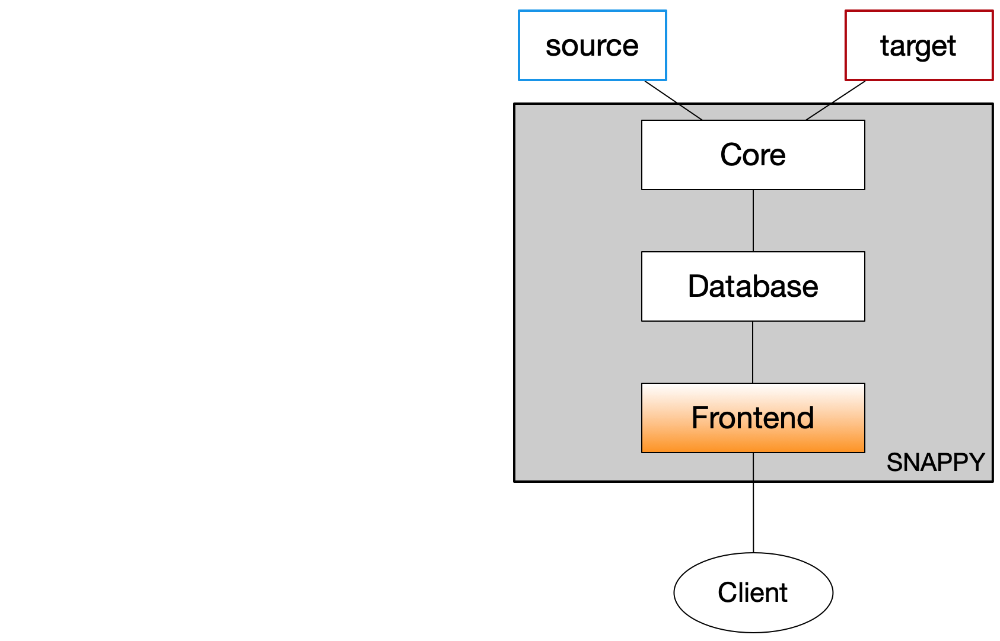

# *Snappy Frontend Documentation*

**Overview**
The Snappy Frontend is the interface through which all commands are passed into a Snappy installation.  Data is backed up, restored and can be listed via a client interacting with the frontend.

  
[Installation](installation.md): Download and install

[Setup](setup.md):  Local variables, sources and targets

 

**Commands**

<table cellspacing="0" cellpadding="0">
<tr>
<td>Backup</td>
<td> 

</td>
<td>Copy from a source to a target</td>
</tr>
<tr>
<td>Restore</td>
<td>

</td>
<td>Copy from a target to a source</td>
</tr>
<tr>
<td>List</td>
<td>

</td>
<td>View Jobs</td>
</tr>
</table>

**Details**
- [Backup](backup.md)

- [Restore](restore.md)

- [List](list.md)
