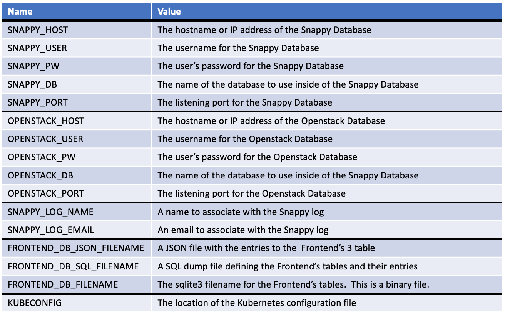

# Setup
Setup for the Snappy frontend includes two sections:

1.  Environment Variables
2.  Tables for Source, Targets and Tenants


## Environment Variables

The environment variables are used to set things such as the details of the Snappy DB, Snappy Agent, logging info and Kubernetes setup info.

To edit the environment variables, use the following command:
```
sudo snappyfe/bin/edit_env_vars
```
If any changes are made, the Snappy Frontend should be restarted in order for them to take affect.

```
sudo snappyfe/bin/stop
sudo snappyfe/bin/start [port]
```
The environment variables and their definitions are as follows:

<br><br>
## Tables
The Snappy Frontend uses 3 tables:  Sources, Targets and Tenants.  These tables are stored in a local sqlite database.

**Sources**
A source is what is being backed up.  

The following sources are currently supposed:
- RBD
<br>

**Targets**
A target is where a backup is stored.

The following targets are currently supported:
- S3
- Swift
<br>

**Tenants**
A tenant how to tell which target will be used.  By changing tenants, the location of a backup will also change.  Because a tenant is part of the URL of the REST command, changing the backup location is a simple as changing the tenant portion of the URL.  In the diagram below, to send that same source to a different target, only the tenant changes (underlined in orange).


A tenant can also have a security component attached to it.

***Editing the tables***

To add or delete a source, target or tenant, use the command:
```
sudo snappyfe/bin/edit_tables
```
The current state of the tables will be shown together with a menu with a list of options:
```
Menu:
1:  Add Source
2:  Add Target
3:  Add Tenant
4:  Delete Source
5:  Delete Target
6:  Delete Tenant
7:  Convert JSON to SQL file
8:  Quit
```
Follow the prompts to add or remove entries into the tables.  After changing any of the tables, you must convert the tables from JSON to SQL using option 7.

**Source Detail:  RBD**

To set up a new RBD source, a name will have to be given.  The following information is also needed:
- IP address of the Ceph monitor
- Ceph user name (generally "admin")
- Ceph user key
- Ceph pool (generially "rbd")


<br>
**Target Detail:  S3**
To set up a new S3 target, a name will have to be given.  The following information is also needed:
-   Swift Proxy URL
-   user name
-   user password
-   Swift container name
-   Swift project name

<br>
**Target Detail:  S3**
To set up a new S3 target source, a name will have to be given.  The following information is also needed:
-   endpoint URL
-   user name
-   user password
-   S3 bucket name
-   S3 region


**Tenant Detail:**
To set up a new S3 target source, a name will have to be given.  Because this name will be used as part of a URL, the name should be limited to alphanumeric characters.  The following information is also needed:
- Auth_type (None or Basic)
- Password (if applicable)
- Target Name (much match one entry in the *Target* table)


<br>
**Tables and Commands example:**

The follow diagram shows how a Backup command that is submitted to the Snappy Frontend takes input from the command, references the local tables and is then sent into the Snappy Database.


See the commands section for more details.
